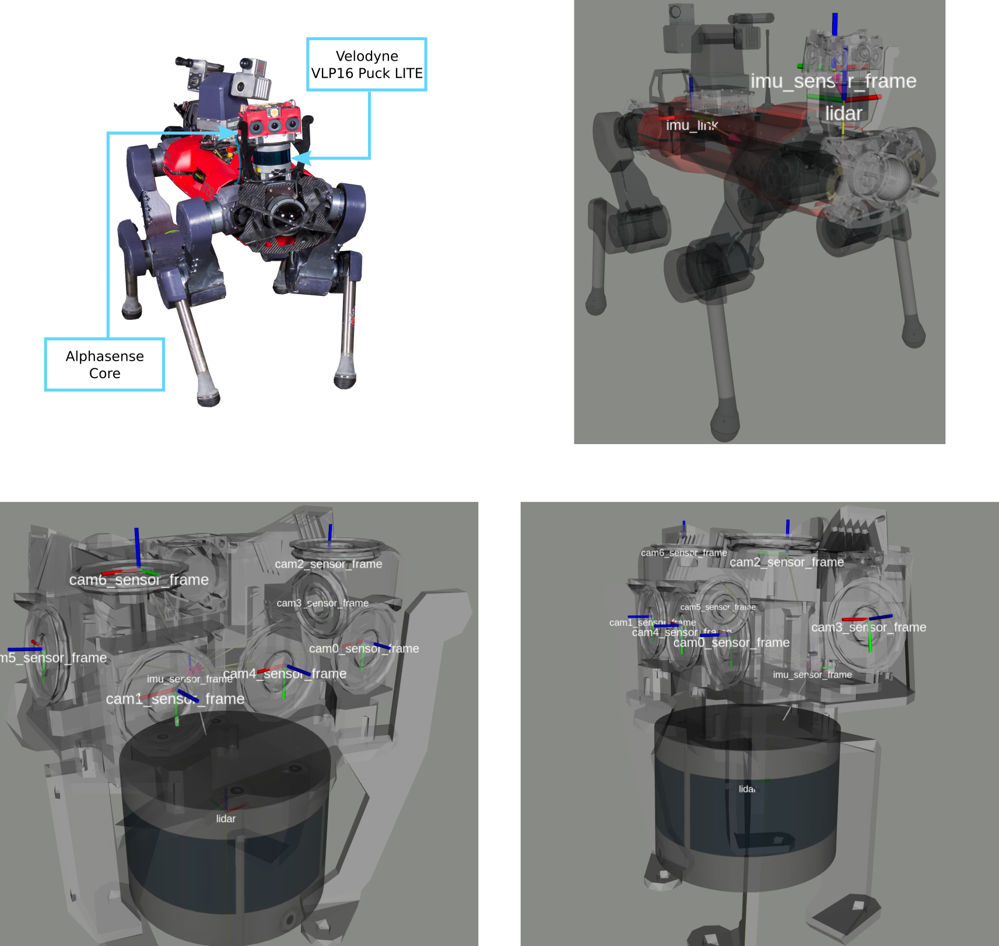

# CERBERUS DARPA Subterranean Challenge Datasets
This repository contains information and links about the datasets collected by Team CERBERUS during the DARPA Subterranean Challenge.

## Credits
Autonomous Robots Lab ([ARL](https://www.autonomousrobotslab.com/)), Robotic Systems Lab ([RSL](https://rsl.ethz.ch/)), Autonomous Systems Lab ([ASL](https://asl.ethz.ch/)), Dynamic Robot Systems Group ([DRS](https://ori.ox.ac.uk/labs/drs/)).

## DARPA Subterranean Challenge
What was the DARPA SubT Challenge?
> The Subterranean (SubT) Challenge was a Defense Advanced Research Projects Agency (DARPA) program to develop innovative technologies that can augment underground operations. The SubT Challenge program explored new approaches to rapidly map, navigate, search, and exploit complex underground environments such as human-made tunnel systems, urban underground, and natural cave networks.

More info at [DARPA SubT](https://www.darpa.mil/program/darpa-subterranean-challenge).

## Team CERBERUS
Team CERBERUS was an international partnership involving the University of Nevada Reno, ETH Zurich, the Norwegian University of Science and Technology (NTNU), University of California Berkeley, University of Oxford, and Flyability.

More info at [subt-cerberus.org](https://www.subt-cerberus.org/).

## Publications
If you use these datasets in an academic context, please cite the following publications:

> M. Tranzatto, T. Miki, M. Dharmadhikari, L. Bernreiter, M. Kulkarni, F. Mascarich, O. Andersson, S. Khattak, M. Hutter, R. Siegwart, K. Alexis
> **"CERBERUS in the DARPA Subterranean Challenge"**,
> in Science Robotics (2022).

    @article{
      doi:10.1126/scirobotics.abp9742,
      author = {Marco Tranzatto  and Takahiro Miki  and Mihir Dharmadhikari  and Lukas Bernreiter  and Mihir Kulkarni  and Frank Mascarich  and Olov Andersson  and Shehryar Khattak  and Marco Hutter  and Roland Siegwart  and Kostas Alexis },
      title = {CERBERUS in the DARPA Subterranean Challenge},
      journal = {Science Robotics},
      volume = {7},
      number = {66},
      pages = {eabp9742},
      year = {2022},
      doi = {10.1126/scirobotics.abp9742},
      URL = {https://www.science.org/doi/abs/10.1126/scirobotics.abp9742},
      eprint = {https://www.science.org/doi/pdf/10.1126/scirobotics.abp9742},
      abstract = {This article presents the core technologies and deployment strategies of Team CERBERUS that enabled our winning run in the DARPA Subterranean Challenge finals. CERBERUS is a robotic system-of-systems involving walking and flying robots presenting resilient autonomy, as well as mapping and navigation capabilities to explore complex underground environments. This article details the winning performance of Team CERBERUS in the DARPA Subterranean Challenge Final Event.}
    }

> M. Tranzatto, M.Dharmadhikari, L. Bernreiter, M. Camurri, S. Khattak, F. Mascarich, P. Pfreundschuh, D. Wisth, S. Zimmermann, M. Kulkarni, V. Reijgwart, B. Casseau, T. Homberger, P. De Petris, L. Ott, W. Tubby, G. Waibel, H. Nguyen, C. Cadena, R. Buchanan, L. Wellhausen, N. Khedekar, O. Andersson , L. Zhang , T. Miki , T. Dang, M. Mattamala, M. Montenegro, K. Meyer, X. Wu, A. Briod, M. Mueller, M. Fallon , R. Siegwart, M. Hutter, K. Alexis
> **"Team CERBERUS Wins the DARPA Subterranean Challenge: Technical Overview and Lessons Learned"**,
> in Field Robotics (2022) (submitted).

    Bibtex reference coming soon!

## Datasets
The following datasets are available online:

### Final Event

**Dataset**: [link](https://www.research-collection.ethz.ch/handle/20.500.11850/552248).

This archive contains sensor data collected on-board the four ANYmal C robots used by Team CERBERUS in their winning run in the DARPA Subterranean Challenge finals. The prize round of the DARPA SubT Final Event took place at the Louisville Mega Cavern in Kentucky on the 23th September 2021. The dataset contains stereo images with synchronized IMU measurements, LiDAR measurements, and ground-truth structure.

#### Available Data
- Visual-Inertial Sensor Unit: Sevensense “Alphasense Core” ([link](https://github.com/sevensense-robotics/alphasense_core_manual))
- LiDAR sensor: Velodyne “VLP16 Puck LITE”
- Trajectories per robot:
  - CompSLAM: Synchronized CompSLAM estimate (during run) and ground truth as CSV, ROS1 bag and ROS2 bag
  - CompSLAM_post: Synchronized CompSLAM estimate (post processed) and ground truth as CSV, ROS1 bag and ROS2 bag
  - M3RM: Synchronized M3RM estimate (post processed) and ground truth as CSV, ROS1 bag and ROS2 bag
  - gt_ros2.bag: Unsynchronized ground truth as ROS2 bag
  - gt_ros1.bag: Unsynchronized ground truth as ROS1 bag
- Calibration:
  - Camera intrinsics
  - Extrinsics with respect to robot’s main frames

#### Robots and Sensors
There were four ANYmal C robots equipped with the following sensors: a) a Sevensense “Alphasense Core” and b) one Velodyne “VLP16 Puck LITE”.

#### Ground-Truth
The robot trajectory ground truth was created by individually registering each robot's VLP16 pointclouds with the DARPA provided ground truth map (details provided in the associated publications). We provide a CSV file for each robot containing the pointcloud timestamp and robot pose with respect to the DARPA frame. The CSV files follow the TUM format (i.e., ts x y z q_x q_y q_z q_w) and can be used with the popular odometry and SLAM evaluation package [EVO](https://github.com/MichaelGrupp/evo/wiki/Formats).
